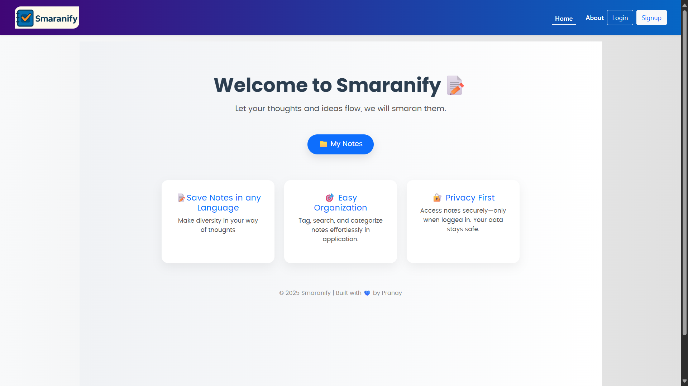
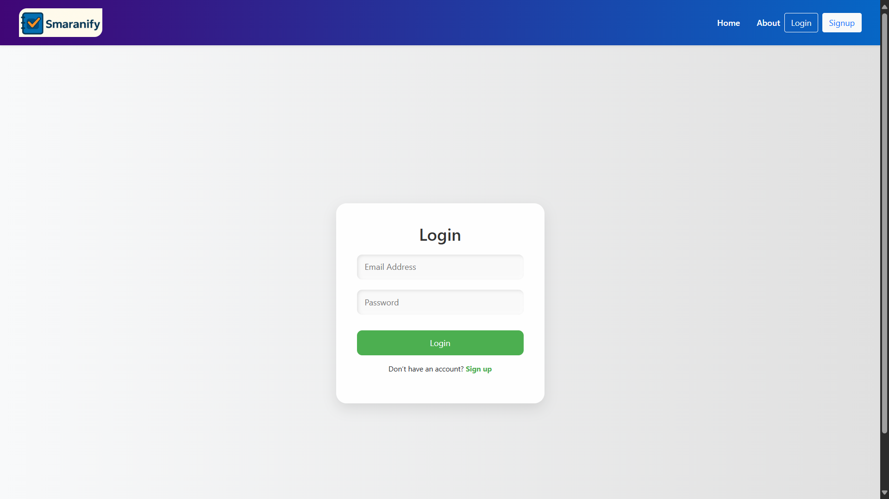
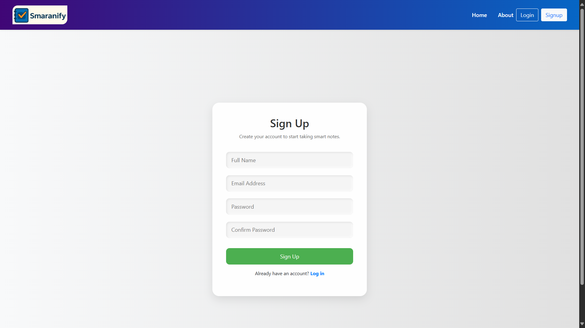
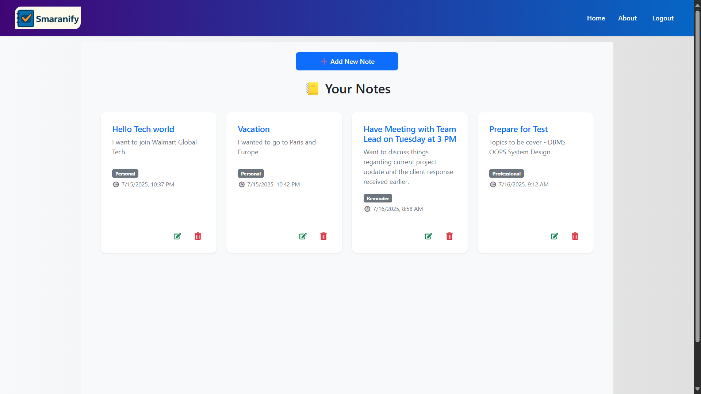
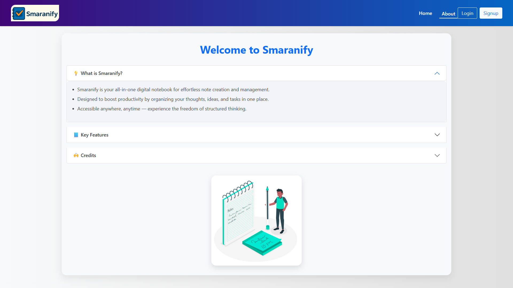

# Smaranify - Your Smart Note-Taking Companion

**Smaranify** is a full-featured MERN (MongoDB, Express, React, Node.js) stack application that helps users securely create, edit, sort, and manage their personal and professional notes.

---

##  Features

-  **User Authentication** – Signup/Login using JWT
-  **Create, Edit & Delete Notes**
-  **Tag-Based Organization** – Personal, Professional, Reminders, etc.
-  **Timestamped Notes** – Auto-save with date & time
-  **Sorting & Filtering** – Sort notes by **tag** or **time**
-  **Responsive & Beautiful UI** – Fully responsive and mobile-friendly

---

## 📸 Screenshots

 
 
 
 
 

## Tech Stack

**Frontend:**
- React.js
- Bootstrap 5
- React Router DOM
- Font Awesome & React Icons

**Backend:**
- Node.js
- Express.js
- MongoDB + Mongoose
- JWT for Auth

---

## Built with 💖 by:

**Pranay Ingle**
